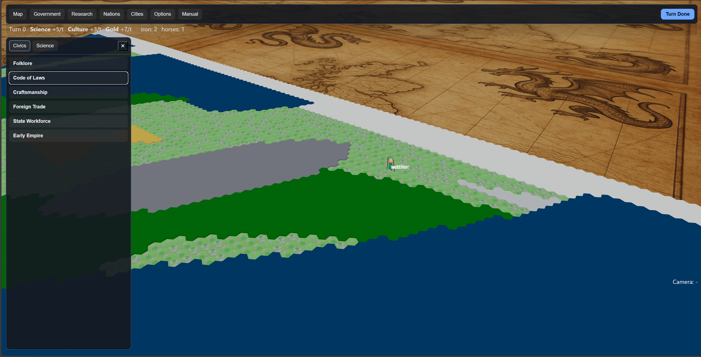

# CivWeb-Lite

[](https://github.com/deadronos/CivWeb-Lite/actions)
[](https://github.com/deadronos/CivWeb-Lite/actions)
[](LICENSE)

CivWeb-Lite is a lightweight, extensible implementation of a Civ-like, turn-based simulation built with React, TypeScript, Vite, and Three.js (via @react-three/fiber).



This repository is for an evolving deterministic simulation: procedural hex-world generation, a turn engine, tech progression, and AI players. The work here is intended to be modular, testable, and easy to extend.

Key goals:

- Deterministic simulation (seedable RNG) for reproducible runs and replays.
- Modular systems: world generation, turn engine, tech trees, AI heuristics, and save/load.
- Small, testable core so features can be iteratively added and verified.

Status: Active development (work in progress). See `spec/spec-architecture-civweb-lite-core.md` and `plan/feature-core-game-foundation-1.md` for requirements and implementation planning.

## Quick start

Install dependencies and run the dev server:

```powershell
npm install
npm run dev
```

Build for production:

```powershell
npm run build
```

Preview a production build:

```powershell
npm run preview
```

Tests and validation:

```powershell
# Run unit tests (Vitest)
npm test

# Run tests in watch mode during development
npm run test:watch

# Run end-to-end tests (Playwright)
npm run test:e2e

# Validate content/schema
npm run validate:data
```

## Project structure

This project follows a canonical `src/` layout. The structure below reflects the current codebase — use these locations when adding or modifying code. If you need to deviate, open a short proposal and update `spec/` and `plan/` with the rationale.

### Runtime flags (dev/testing)

- Per-instance tile colors (experimental): append `?pic=1` to the URL. Default rendering uses uniform per-biome colors for cross-driver stability.
- Instancing probe: append `?probe=1` to show a tiny red/green two-instance mesh near the origin (sanity check for instancing colors).
- Verbose instancing logs: in devtools console, run `window.__CWL_DEBUG = true` and refresh to enable detailed `[debug] InstancedTiles` logs. Set to `false` (or reload) to silence.

```text
src/
├── app.tsx                 # Top-level React app (uses GameProvider)
├── main.tsx                # React bootstrap / entry
├── components/             # UI and game components (game-hud, overlays, panels)
├── contexts/               # Context providers (GameProvider, hover, etc.)
├── hooks/                  # Custom hooks (use-game.ts)
├── scene/                  # three/@react-three/fiber scene and helpers
├── styles.css
├── types/
├── game/ or game-logic/    # Simulation systems and utilities
└── ...
```

## How to contribute

- Follow the authoritative `src/` layout above. If a feature requires a different layout, create a short proposal and update both `spec/spec-architecture-civweb-lite-core.md` and `plan/feature-core-game-foundation-1.md` documenting the reason and the proposed file placement.
- Keep changes small and focused. Use conventional commits: `feat:`, `fix:`, `docs:`, `test:`, etc.
- Add tests for logic-heavy modules (Vitest recommended) and include at least one happy-path test plus 1-2 edge cases for new behaviors.
- Avoid committing secrets. Use environment variables for any keys or tokens.

## Development practices

- Use the `useGame()` hook from `src/hooks/use-game.ts` to read the canonical, read-only game state in UI components. The codebase exports `GameProvider` from `src/contexts/game-provider.tsx` and many components consume the hook from `src/hooks/use-game.ts`.
- Prefer pure functions for simulation logic so state transitions are deterministic and testable.
- Use the provided seedable RNG utilities in `src/game/rng.ts` rather than `Math.random()` to ensure reproducibility.

## Linting note (TypeScript / @typescript-eslint)

This repository currently uses a stable `@typescript-eslint` release with ESLint configured via `eslint.config.cjs`.

- Current TypeScript in the repo: 5.9.x (may be newer on contributor machines).
- Current `@typescript-eslint` stable release: 8.43.0.

There is a known compatibility warning where `@typescript-eslint` lists a supported TypeScript range that does not yet include 5.9. The linter and parser generally still work, but type-aware lint rules may behave unexpectedly in some edge cases.

If you hit parser or type-analysis errors from ESLint locally or in CI, consider one of the following:

1. Temporarily pin `typescript` to a supported version (for example `5.5.x`) in your local environment or CI image.
2. Use the `@typescript-eslint` canary builds if you need immediate support for newer TypeScript features (note: canary releases may be unstable).
3. Report the failing rule/output here in an issue and the maintainers will triage and either pin or upgrade accordingly.

When opening PRs, don't be alarmed by the compatibility warning — it's informational. Run `npm run lint` and file an issue if you see rule failures that appear to be caused by the parser mismatch.

## Documentation & planning

- Specification: `spec/spec-architecture-civweb-lite-core.md` — definitive requirements and constraints.
- Implementation plan: `plan/feature-core-game-foundation-1.md` — tasks, phases, tests, and files to implement.

## License

This project is licensed under the MIT license — see `LICENSE`.

## Contact

Owner: deadronos — open issues or PRs for collaboration.

---
